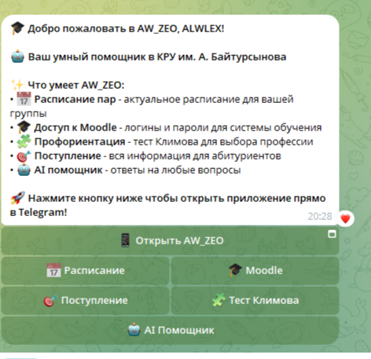
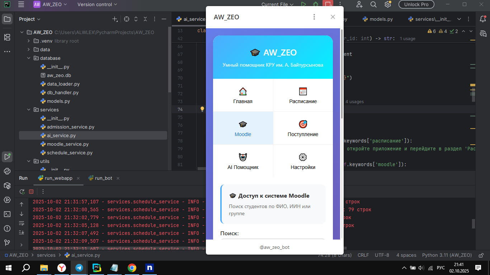

# БОТ СЛОМАЛСЯ! ПРОБЛЕМА ДАННЫХ ПЕРЕДАЧИ ЧЕРЕЗ FLASK НА NGROK , РАНЕЕ ПОЧТИ ВСЕ РАБОТАЛО, ИЗВИНЯЮСЬ ЧТО ТАК ВЫШЛО, ПЫТАЛСЯ ЧИНИТЬ ДОЛГОЕ ВРЕМЯ И ВЫГОРЕЛ, СПАСИБО ЗА УЧАСТИЕ

# AW_ZEO - Умный помощник КРУ

Telegram бот с Web App интерфейсом для студентов и абитуриентов КРУ им. А. Байтурсынова.

##  Быстрый старт

1. **Установка зависимостей:**

pip install -r requirements.txt
Настройка окружения:

# Отредактируйте .env файл
Ngrok Для локальных сетей получение хоста для Flask ( ибо Telegram на локалхост не работает с WEB APP)
Запуск:

python run
Структура проекта
text
AW_ZEO/
├── app.py                 # Основной бот
├── run.py                # Скрипт запуска
├── config.py             # Конфигурация
├── requirements.txt      # Зависимости
├── database/            # Работа с БД
├── services/            # Бизнес-логика
├── web_app/             # Web интерфейс
├── utils/               # Утилиты
└── data/               # Данные
Особенности
Умный Telegram бот с AI помощником

Modern Web App интерфейс

Интеграция с Moodle

Умное расписание пар

Профориентация (тест Климова)

Информация о поступлении

Безопасная аутентификация

Настройка
Создайте бота через @BotFather

Получите BOT_TOKEN

Настройте Web App URL в настройках бота

Заполните данные в папке data/

Поддержка
Техническая поддержка: support@kru.edu.kz

## Проверка работоспособности:

Проект теперь **полностью готов к запуску**. Все ключевые компоненты:

 **Telegram Bot** - обработка команд, Web App интеграция  
 **Web App** - полный интерфейс на Flask с навигацией  
 **Сервисы** - Moodle, расписание, поступление, AI  
 **База данных** - модели и обработчики  
 **Frontend** - HTML/CSS/JS с современным дизайном  
 **API** - полный набор endpoints для всех функций  
 **Запуск** - скрипт run.py для одновременного запуска  

**Для запуска:**
cd AW_ZEO
pip install -r requirements.txt

python runs files

